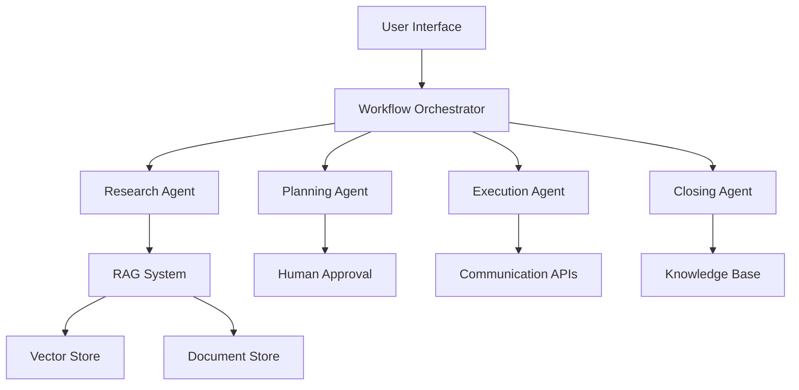

# Multi-Agent Ticketing Assistant

> **Technical Demo** - A sophisticated demonstration of how modern multi-agent AI systems can transform enterprise ticketing workflows

This portfolio project simulates an intelligent technical support system for **Pumpen GmbH**, a fictional German pump manufacturer. The demo showcases cutting-edge AI frameworks including **Multi-Agent Systems**, **Research-Plan-Execute (RPE)**, **Retrieval-Augmented Generation (RAG)**, **Human-in-the-Loop workflows**, and **Lean Prototyping** methodologies.

## 🔗 Links

- **📋 Project Details**: [https://brianjin.eu/portfolio/multi-agent-ticketing/](https://brianjin.eu/portfolio/multi-agent-ticketing/)
- **👨‍💻 Creator**: [Brian Jin](https://brianjin.eu/#hero) | [Just Forward Team](https://www.just-forward.com/team-members/brian)

---

## 🚀 Live Demo

Experience the demo at: [Streamlit Community Cloud](https://multi-agent-ticket-assistant.streamlit.app)

## 🎯 Technical Frameworks Demonstrated

### **Multi-Agent Systems Architecture**
- **Research Agent**: Intelligent information gathering across multiple data sources
- **Planning Agent**: Strategic action plan generation with confidence scoring
- **Execution Agent**: Automated task execution with human oversight
- **Closing Agent**: Knowledge synthesis and documentation

### **Research-Plan-Execute (RPE) Workflow**
- **Research Phase**: AI-powered context gathering from CRM, documentation, and historical tickets
- **Planning Phase**: Human-in-the-loop plan approval with AI-generated risk assessments
- **Execution Phase**: Automated customer communications and internal documentation
- **Closing Phase**: Knowledge capture for organizational learning

### **Retrieval-Augmented Generation (RAG)**
- **Vector Search**: Semantic similarity matching across technical documentation
- **Context Injection**: Dynamic prompt engineering with retrieved information
- **Source Attribution**: Provenance tracking for AI-generated responses
- **Hybrid Search**: Combined keyword and semantic search strategies

### **Human-in-the-Loop Integration**
- **Approval Gates**: Critical decision points requiring human validation
- **Feedback Loops**: Continuous improvement through human corrections
- **Escalation Paths**: Automatic handoff for complex scenarios
- **Audit Trails**: Complete decision history and reasoning transparency

### **Lean Prototyping Methodology**
- **Rapid Iteration**: Streamlit-based interface for fast development cycles
- **Mock Agents**: Realistic AI behavior simulation without API dependencies
- **Modular Architecture**: Component-based design for easy experimentation
- **Data-Driven UX**: German localization and authentic business context

## 🏗️ Technical Architecture



### **Agent Responsibilities**

**🔍 Research Agent**
- CRM data fuzzy matching and customer identification
- Technical manual semantic search with relevance scoring
- Historical ticket similarity analysis using embeddings
- Multi-source information synthesis with confidence metrics

**📋 Planning Agent**
- Risk assessment and difficulty scoring
- Resource requirement estimation
- Step-by-step action plan generation
- Human approval workflow integration

**⚡ Execution Agent**
- Customer communication drafting (German B2B standards)
- Internal documentation generation
- Task automation with progress tracking
- Exception handling and escalation logic

**✅ Closing Agent**
- Knowledge gap analysis and followup question generation
- Comprehensive report synthesis
- Organizational learning capture
- Searchable knowledge base population

## 📁 Project Structure

```
multi-agent-ticket-assistant/
├── app/
│   ├── core/                   # Core business logic
│   │   ├── data.py            # Data loading and management
│   │   ├── models.py          # Pydantic data models
│   │   ├── *_agents.py        # AI agent implementations
│   │   └── *_models.py        # Agent-specific data structures
│   └── ui/                    # Streamlit interface
│       ├── main.py           # Application entry point
│       ├── components/       # UI component modules
│       └── utils/           # Utilities and state management
├── data/                      # Demo dataset (German content)
│   ├── crm.json              # Customer relationship data
│   ├── tickets.jsonl         # Historical support tickets
│   ├── closing_notes.json    # Resolution examples
│   ├── manuals/             # Technical documentation
│   └── sops/               # Communication guidelines
└── tests/                    # Unit tests and validation
```

## 🔄 Demo Workflow

### **1. Research Phase (RPE: Research)**
- **Customer Identification**: Fuzzy matching against CRM database
- **Context Gathering**: RAG-powered search across technical manuals
- **Historical Analysis**: Semantic similarity search of previous tickets
- **Intelligence Synthesis**: Multi-source information consolidation

### **2. Planning Phase (RPE: Plan + Human-in-the-Loop)**
- **Risk Assessment**: AI-generated difficulty and resource estimates
- **Action Planning**: Step-by-step resolution strategy
- **Human Approval**: Required validation before execution
- **Plan Refinement**: Iterative improvement based on feedback

### **3. Execution Phase (RPE: Execute)**
- **Communication Drafting**: AI-generated customer responses (German B2B style)
- **Documentation**: Automated internal note creation
- **Progress Tracking**: Real-time execution monitoring
- **Quality Control**: Human oversight and approval gates

### **4. Closing Phase (Knowledge Capture)**
- **Gap Analysis**: AI identifies missing information for complete documentation
- **Report Generation**: Comprehensive resolution summary
- **Knowledge Extraction**: Searchable insights for future tickets
- **Organizational Learning**: Continuous improvement feedback loop

## 🚀 Quick Start

### Prerequisites
- Python 3.8+
- OpenAI API key (for production) or use mock agents for demo

### Installation

1. **Clone and setup:**
   ```bash
   git clone https://github.com/zer0dude/multi-agent-ticket-assistant.git
   cd multi-agent-ticket-assistant
   pip install -r requirements.txt
   ```

2. **Environment configuration:**
   ```bash
   cp .env.example .env
   # Edit .env with your API keys (optional - works with mock agents)
   ```

3. **Launch demo:**
   ```bash
   streamlit run app/ui/main.py
   ```

4. **Access interface:**
   - Open browser to `http://localhost:8501`
   - Navigate through the demo workflow
   - Experience multi-agent AI in action

## 🇩🇪 German Localization

The demo features authentic German B2B communication to demonstrate real-world enterprise scenarios:

- **Interface Language**: Complete German localization for SME target market
- **Business Context**: Realistic German manufacturing company (Pumpen GmbH)
- **Communication Standards**: Professional German technical support language
- **Cultural Adaptation**: German business etiquette and communication patterns

## 🛠️ Technical Implementation

### **Technologies Used**
- **Frontend**: Streamlit for rapid prototyping
- **Backend**: Python with Pydantic for type safety
- **AI/ML**: OpenAI GPT models with custom prompt engineering
- **Search**: Custom RAG implementation with TF-IDF and semantic search
- **Data**: JSON/JSONL for lightweight, version-controlled datasets

### **Key Technical Features**
- **Session State Management**: Persistent workflow state across Streamlit sessions
- **Mock Agent System**: Realistic AI behavior simulation for development
- **Modular Architecture**: Clean separation between agents, models, and UI
- **Error Handling**: Graceful degradation and user-friendly error messages
- **Responsive Design**: Mobile-friendly interface for modern UX

## 🤝 Contributing

This is a technical demonstration project. For questions or collaboration opportunities:

- **Project Discussion**: [GitHub Issues](https://github.com/zer0dude/multi-agent-ticket-assistant/issues)
- **Technical Details**: [Portfolio Project Page](https://brianjin.eu/portfolio/multi-agent-ticketing/)
- **Professional Contact**: [Brian Jin](https://brianjin.eu/#hero)

## 📄 License

MIT License - see LICENSE file for details.

---

*This project demonstrates advanced AI application architecture for enterprise scenarios. Built with modern software engineering practices and designed for scalable, production-ready deployment.*
